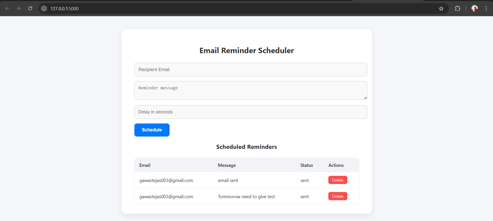
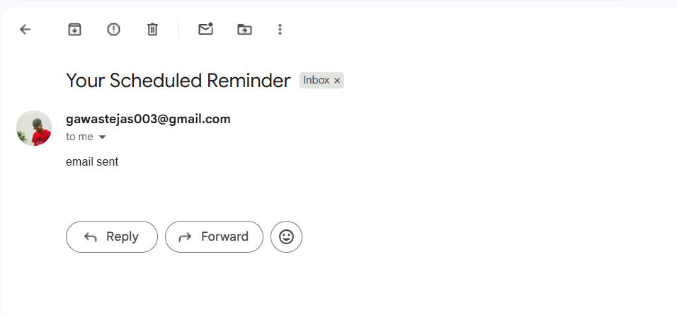

# 📬 Async Email Reminder App

A minimal yet powerful Flask-based web app that lets users **schedule email reminders with a delay**, handled in the background using **Celery** and **Redis**, and sent using **Gmail SMTP**.

---
### Preview





---

## 🚀 Features

- 📩 Schedule delayed email reminders
- ⏱️ Async background task handling with Celery
- 🔁 Redis as task broker
- 🗄️ Persistent storage using SQLite + SQLAlchemy
- 📬 Real-time email delivery using Gmail SMTP + App Password
- 📋 View all scheduled reminders
- 🗑️ Delete sent/scheduled reminders
- 🎨 Clean frontend UI (HTML, JS, CSS)

---

## 🛠 Tech Stack

- **Backend**: Flask, Celery, SQLAlchemy
- **Async Broker**: Redis
- **Email Service**: Gmail SMTP + App Password
- **Frontend**: HTML, Vanilla JS, CSS
- **Database**: SQLite
- **Tools**: Postman, Git, Python dotenv

---

## 💻 Setup Instructions

### 1. Clone the repo
```bash
git clone https://github.com/Tejashgawas/email-reminder-app.git
cd email-reminder-app
```

### 2. Create virtual environment
```
python -m venv myvene
myvene\Scripts\activate   # Windows
```

### 3. Install dependencies
```
pip install -r requirements.txt
```

### 4. Configure environment variables
```
EMAIL_USER=your_email@gmail.com
EMAIL_PASS=your_app_password  # 16-digit App Password
```

### 5. Start Redis Server (Local)
Make sure Redis is installed and running:
```
redis-server
```
### 6. Run Flask app
```
python app.py
```
### 7. Start Celery worker
```
celery -A celery_worker.celery worker --loglevel=info --pool=solo
```
✅ Visit: http://127.0.0.1:5000

## 🤝 Contributing
Feel free to fork and enhance. PRs are welcome!

## 📄 License
MIT License © 2025 Tejash Gawas
